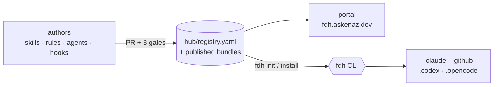

# Forge Development Hub

[](https://github.com/askenaz-dev/forge-development-hub/actions/workflows/validate-registry.yml)
[](LICENSE)
[](https://fdh.askenaz.dev)

**The harness fabric for AI coding agents — author a skill, rule, agent, or hook once, weave it into a harness, and ship it byte-identical to every agent your team uses.**

This repo is the source of truth for the **skills, rules, agents, and hooks** that power Forge developers' AI coding agents (Claude Code, Codex, Copilot, OpenCode). Components are authored here, published to a versioned, hash-verified registry, bundled into **harnesses**, and either installed with the [`fdh`](https://github.com/askenaz-dev/forge-development-hub-cli) CLI or browsed in the [portal](https://fdh.askenaz.dev).

## Try it in 30 seconds

```sh
npx @askenaz-dev/fdh init
```

A wizard detects which AI agent(s) you have (Claude Code, Codex, Copilot, OpenCode), lets you pick a harness, and materializes the right files into your project — no prior install of `fdh` needed. Make it permanent with `npm i -g @askenaz-dev/fdh`.

> **No Node?** The CLI also ships as a POSIX one-liner, a PowerShell script, and `.deb`/`.rpm` packages — see [the CLI quickstart](https://github.com/askenaz-dev/forge-development-hub-cli/blob/main/docs/quickstart.md).

## What's in the hub

Four primitives, one catalog (`hub/registry.yaml`, schema v2), discriminated by `kind`:

| Primitive | What it does | Example |
|---|---|---|
| `skill` | On-demand workflow guidance | [`design-system`](skills/design-system/) — Forge DS rules + component catalog |
| `rule` | Always-on guideline scoped by glob | [`no-console-log`](rules/no-console-log/) — prohibits `console.log` in TS/JS |
| `agent` | Specialized subagent + tools | [`forge-pr-writer`](agents/forge-pr-writer/) — PR descriptions in house style |
| `hook` | Event-triggered command | [`doctor-on-session-start`](hooks/doctor-on-session-start/) — runs `fdh doctor` at session start |

Curated **harnesses** (`hub/harnesses.yaml`) bundle components across kinds so a consumer grabs a vetted set in one line:

```yaml
# .fdh/manifest.yaml
harness: default     # exercises all four primitives end-to-end
```

`fdh init` resolves your `.fdh/manifest.yaml` against the catalog and writes a `.fdh/lock.yaml` snapshot — so every teammate runs `fdh install` and gets **byte-identical AI tooling**, regardless of machine.

## How it fits together



## Why a harness fabric

- **One source, four agents.** Author once; the `fdh` CLI materializes into each ecosystem's conventions — no copy-paste drift.
- **Versioned + verified.** Every component is published as a content-hashed bundle and security-scanned (`scan_status` shown in the portal).
- **Governed contribution.** Components land through a reviewed PR flow with three gates (author → reviewer/publisher → admin adoption).
- **Reproducible installs.** A committed lockfile pins exactly what each consumer project gets.

## Documentation

| Guide | For | Covers |
|---|---|---|
| **[Hub Guide](docs/hub-guide.md)** | everyone | what the hub is, the 4 primitives, **when to use which**, how components are consumed |
| **[Authoring Guide](docs/authoring-guide.md)** | collaborators | per-kind frontmatter templates, the registry entry, local validation, PR flow, CLI **and** no-CLI paths |
| **[Maintainer Runbook](docs/maintainer-runbook.md)** | admins | marking `default`, deprecating/yanking, the release pipeline, CODEOWNERS, `scan_status` |

New here? Start with the **Hub Guide**, then the **Authoring Guide** to ship your first component.

## Adding a component (tl;dr)

1. Create `<kind>s/<name>/` with the entrypoint file (`SKILL.md` / `RULE.md` / `AGENT.md` / `HOOK.md`).
2. Add an entry to `hub/registry.yaml` with the matching `kind` + `path`.
3. (Optional) reference it from a harness in `hub/harnesses.yaml`.
4. `python tools/validate-registry.py`.
5. Open a PR — CI validates the catalog on every push.

Full walkthrough + copy-pasteable templates: **[Authoring Guide](docs/authoring-guide.md)**.

## Repository layout

```
hub/
├── registry.yaml         # schema v2 — all 4 primitives, discriminated by `kind`
├── harnesses.yaml        # curated bundles consumers reference
├── README.md             # layout + add-a-component flow
└── CONSUMER-CONTRACT.md  # .fdh/manifest.yaml, .fdh/lock.yaml, ~/.fdh/state.json schemas
skills/<name>/SKILL.md    # one directory per skill
rules/<name>/RULE.md      # one directory per rule
agents/<name>/AGENT.md    # one directory per agent
hooks/<name>/{HOOK.md, hook.json}
docs/                     # hub guide, authoring guide, maintainer runbook
tools/                    # python validators (CI invokes these)
.github/workflows/        # CI: catalog + harnesses + fixtures
```

## Specs & changes

Requirements for this repo's behavior (the `hub-*` capabilities) live in the OpenSpec workspace at **[askenaz-dev/forge-specs](https://github.com/askenaz-dev/forge-specs)** (`openspec/specs/`) — not in this repo. Changes move through Explore → Propose → Apply → Archive; run `openspec` from `forge-specs/`. Clone it and run `scripts/meta-clone` to lay this repo and the CLI out as siblings.

## Validation locally

```sh
python tools/validate-registry.py                                # catalog + 4 kinds + harnesses
python tools/validate-manifest.py tests/fixtures/manifests/<...>.yaml
python -m unittest discover -s tests                             # unit tests
```

CI runs these on every PR touching `hub/`, `skills/`, `rules/`, `agents/`, `hooks/`, `tools/`, or `tests/`.

## Sibling repos

- **[`forge-development-hub-cli`](https://github.com/askenaz-dev/forge-development-hub-cli)** — the Go CLI + Next.js portal.
- **[`forge-specs`](https://github.com/askenaz-dev/forge-specs)** — the OpenSpec workspace (all specs + changes).

## License

MIT — see [LICENSE](LICENSE).
